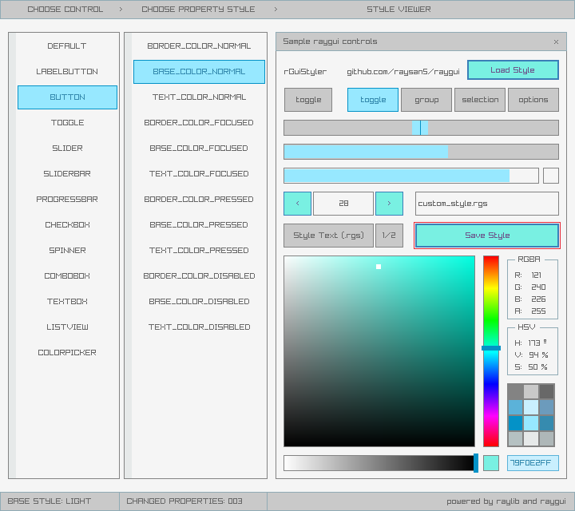

**raygui** is a simple and easy-to-use immediate-mode-gui single-file header-only library.

raygui was inspired by [Unity IMGUI](https://docs.unity3d.com/Manual/GUIScriptingGuide.html) (immediate mode GUI API).

raygui was originated as an auxiliar module for [raylib](https://github.com/raysan5/raylib) to create simple GUI interfaces using raylib graphic style (simple colors, plain rectangular shapes, wide borders, raylib default font...).

raygui is intended for **tools development**; it has already been used on tools like [rFXGen](https://github.com/raysan5/rFXGen), [rGuiStyler](https://github.com/raysan5/raygui/tree/master/tools) and [rGuiLayout](https://github.com/raysan5/raygui/tree/master/tools).

 

## raygui styles: light & dark

## raygui history
raygui development started on December 2014 by two intenship students (Kevin Gato and Daniel Nicolas) guided by me, the objective was creating a simple and easy-to-use raylib immediate-mode-gui module, intended for tools development. On June 2015, library was mostly functional (including all planned controls) and work started into the styling options for the library, focusing on an easy way to style some controls properties. Consequently, development of [rGuiStyler](https://github.com/raysan5/raygui/tree/master/tools/rGuiStyler) also started at that point but resources invested on the tool were quite limited and project didn't move much during the following year, most of the time was invested in [raylib](https://github.com/raysan5/raylib) development.

On June 2016, project was picked up again and raygui 1.0 was released at the end of that month. During August 2016, raygui was used to develop [rFXGen](https://github.com/raysan5/rFXGen) and a protoype of [rGuiLayout](https://github.com/raysan5/raygui/tree/master/tools/rGuiLayout) was created, mainly as an usage prove test. After that, raygui project remained stopped for the following months.

On June 2017, started a complete redesign of the library, almost from scratch, all functions were reviewed and mostly rewritten and a brand new styling system was developed. The objective was using raygui professionally in several tools planned for raylib.

On January 2018, two students (Adria and Jordi) started working on raygui and related tools. Consequently, library and tools evolved A LOT in the following months. [rGuiStyler](https://github.com/raysan5/raygui/tree/master/tools/rGuiStyler) was completely redesigned and rewritten from scratch. [rGuiLayout](https://github.com/raysan5/raygui/tree/master/tools/rGuiLayout) turned from a protoype into a professional software and raygui reached version 2.0 with plenty of new controls and features.

## raygui 2.0 provided controls

#### Container/separator controls, useful for controls organization

 - WindowBox
 - GroupBox
 - Line
 - Panel

#### Basic controls

 - Label
 - Button
 - LabelButton
 - ImageButton
 - ToggleButton
 - ToggleGroup
 - CheckBox
 - ComboBox
 - DropdownBox
 - Spinner
 - ValueBox
 - TextBox
 - Slider
 - SliderBar
 - ProgressBar
 - StatusBar
 - ScrollBar (WIP)
 - DummyRec

#### Advance controls
 - ListView
 - ColorPicker
 - GuiMessageBox
 - Grid

## Acknowledgements
The following people has invested their time and effort into raygui project. Big thanks to them!

 - Adria Arranz and Jordi Jorba for improving raygui, adding new controls and working on [rGuiStyler](https://github.com/raysan5/raygui/tree/master/tools/rGuiStyler) and [rGuiLayout](https://github.com/raysan5/raygui/tree/master/tools/rGuiLayout) tools redesign and rewrite.
 - [Sergio Martinez](https://github.com/anidealgift) for improving raygui and working on [rGuiStyler](https://github.com/raysan5/raygui/tree/master/tools/rGuiStyler) tool.
 - Daniel Nicolas and [Kevin Gato](https://github.com/Gatonevermind) for working on initial development.
