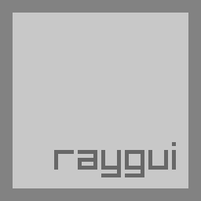
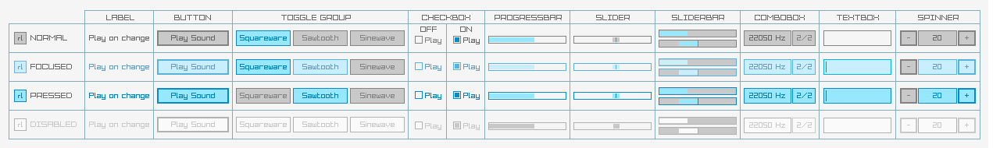
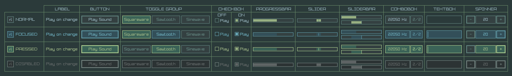

**raygui** is a simple and easy-to-use IMGUI header-only library.

raygui was inspired by [Unity IMGUI](https://docs.unity3d.com/Manual/GUIScriptingGuide.html) (immediate mode GUI API).

raygui was originated as an auxiliar module for [raylib](https://github.com/raysan5/raylib) to create simple GUI interfaces using raylib graphic style (simple colors, plain rectangular shapes, wide borders, raylib default font...). 

raygui has been used on some tools like [rFXGen](https://github.com/raysan5/rFXGen), without external dependencies, only raylib.

 
 

**NOTE: raygui is under development right now, some controls and styles could be modified in the following weeks.** 

##  styles
Default light style

Default dark style

## history
raygui development started on December 2014 by two intenship students guided by me (Kevin Gato and Daniel Nicolas), the objective was creating a simple and easy-to-use raylib IMGUI module. On June 2015, library was mostly functional (including all planned controls) and work started into the styling options for the library. Development on [rGuiStyler](https://github.com/raysan5/raygui/tree/master/tools/rGuiStyler) also started at that point but resources invested on the tool were quite limited and project didn't move much during the following year, most of the time was invested in [raylib](https://github.com/raysan5/raylib).

Finally, by the end of June 2016, project was picked up again and raygui 1.0 was released. During August 2016, raygui was used to develop [rFXGen](https://github.com/raysan5/rFXGen) and [rGuiLayout](https://github.com/raysan5/raygui/tree/master/tools/rGuiLayout) tools. 

On June 2017, project was picked up again to be completely redesigned, almost from scratch, all functions have been rewritten and style system has been redesigned, being greatly improved. The objective of that work is using raygui in several tools for raylib. [rGuiStyler](https://github.com/raysan5/raygui/tree/master/tools/rGuiStyler) is also being updated an improved.

## notes on raygui 1.0
Officially, raygui 1.0 was published on June 2016, about one year and a half after its developmentment started.

## notes on raygui 1.x
Expect to be published along 2017, a complete redesign of the library with improved style system.

## controls
Currently raygui provides the following controls:
 - Label
 - Button
 - ToggleButton
 - ToggleGroup
 - CheckBox
 - ComboBox
 - Slider
 - SliderBar
 - ProgressBar
 - Spinner
 - TextBox

## acknowledgements
The following people has invested their time and effort into raygui project. Big thanks to them!

 - [Kevin Gato](https://github.com/Gatonevermind) for working on initial development.
 - Daniel Nicolas  for working on initial development.
 - [Sergio Martinez](https://github.com/anidealgift) for improving raygui and working on [rGuiStyler](https://github.com/raysan5/raygui/tree/master/tools/rGuiStyler) tool.
