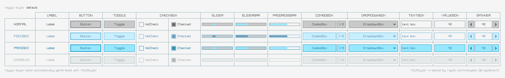

**raygui** is a simple and easy-to-use immediate-mode-gui library.

raygui was initially inspired by [Unity IMGUI](https://docs.unity3d.com/Manual/GUIScriptingGuide.html) (immediate mode GUI API).

raygui was originated as an auxiliar module for [raylib](https://github.com/raysan5/raylib) to create simple GUI interfaces using raylib graphic style (simple colors, plain rectangular shapes, wide borders, raylib default font...).

raygui is intended for **tools development**; it has already been used to develop the following tools: [rFXGen](https://github.com/raysan5/rfxgen), [rTexViewer](https://raylibtech.itch.io/rtexviewer), [rGuiStyler](https://raylibtech.itch.io/rguistyler) and [rGuiLayout](https://raylibtech.itch.io/rguilayout).

<br>

## raygui provided controls

#### Container/separator controls
```
WindowBox   |  GroupBox    |  Line        |  Panel
```
#### Basic controls
```
Label       |  Button      |  LabelButton |  ImageButton  |  Toggle      |  ToggleGroup |  CheckBox
ComboBox    |  DropdownBox |  TextBox     |  TextBoxMulti |  ValueBox    |  Spinner     |  Slider   
SliderBar   |  ProgressBar |  StatusBar   |  ScrollBar    |  ScrollPanel |  DummyRec    |  Grid
```
#### Advance controls
```
ListView    |  ColorPicker |  MessageBox  |  TextInputBox
```

## raygui styles

raygui comes with a [default](styles/default) style automatically loaded at runtime:



Some additional styles are also provided for convenience, just check [styles directory](styles) for details:


Custom styles can also be created very easily using [rGuiStyler](https://raylibtech.itch.io/rguistyler) tool. 

Styles can be loaded at runtime using raygui `GuiLoadStyle()` function. Simple and easy-to-use.


*rGuiStyler v3.1 - raygui styles editor, useful to create custom styles*
 
## raygui icons: ricons

`raygui` includes a separate module with a set of custom handcrafter icons, ready to be used and integrated in a easy way with `raygui`. This module is called `ricons.h` and can be automatically included just defining `RAYGUI_SUPPORT_RICONS` before including `raygui`. 


```c
#define RAYGUI_IMPLEMENTATION
#define RAYGUI_SUPPORT_RICONS
#include "raygui.h"
```
To use any of those icons in your gui, just preprend *iconId* to any text written within `raygui` controls:
```c
if (GuiButton(rec, "#05#Open Image") { /* ACTION */ }
```
or use the provided `GuiIconText()` function to prepend it automatically, using a clearer identifier.
```c
if (GuiButton(rec, GuiIconText(RICON_FILE_OPEN, "Open Image"))) { /* ACTION */ }
```

license
-------

raygui is licensed under an unmodified zlib/libpng license, which is an OSI-certified, BSD-like license that allows static linking with closed source software. Check [LICENSE](LICENSE.md) for further details.
