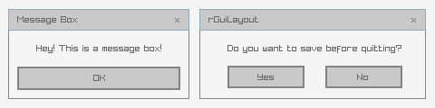
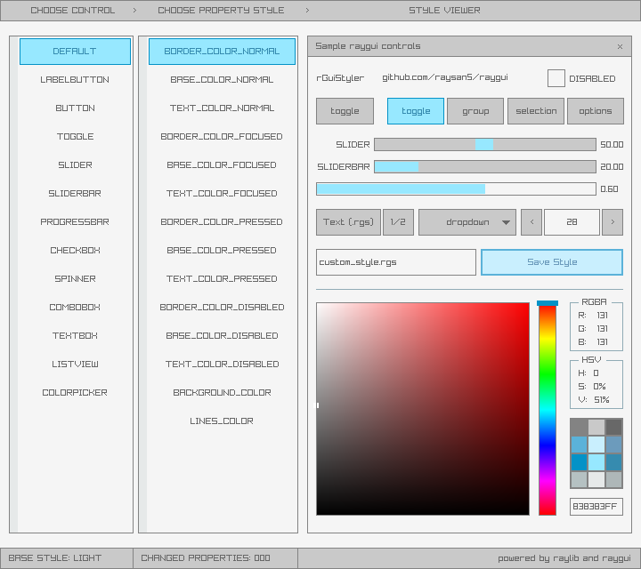

**raygui** is a simple and easy-to-use immediate-mode-gui library.

raygui was initially inspired by [Unity IMGUI](https://docs.unity3d.com/Manual/GUIScriptingGuide.html) (immediate mode GUI API).

raygui was originated as an auxiliar module for [raylib](https://github.com/raysan5/raylib) to create simple GUI interfaces using raylib graphic style (simple colors, plain rectangular shapes, wide borders, raylib default font...).

raygui is intended for **tools development**; it has already been used to develop the following tools: [rFXGen](https://github.com/raysan5/rfxgen), [rTexViewer](https://raylibtech.itch.io/rtexviewer), [rGuiStyler](https://raylibtech.itch.io/rguistyler) and [rGuiLayout](https://raylibtech.itch.io/rguilayout).

 

## raygui styles

raygui comes with a [default](styles/default) style automatically loaded at runtime:

Some additional styles are also provided for convenience, just check [styles directory](styles).

Custom styles can also be created very easily using [rGuiStyler](https://raylibtech.itch.io/rguistyler) tool. 

Styles can be loaded at runtime using raygui `GuiLoadStyle()` function. Simple and easy-to-use.

## raygui 2.6 provided controls

#### Container/separator controls, useful for controls organization

 - WindowBox
 - GroupBox
 - Line
 - Panel

#### Basic controls

 - Label
 - Button
 - LabelButton
 - ImageButton
 - Toggle
 - ToggleGroup
 - CheckBox
 - ComboBox
 - DropdownBox
 - TextBox
 - TextBoxMulti
 - ValueBox
 - Spinner
 - Slider
 - SliderBar
 - ProgressBar
 - StatusBar
 - ScrollBar
 - ScrollPanel
 - DummyRec
 - Grid

#### Advance controls
 - ListView
 - ColorPicker
 - MessageBox
 - TextInputBox

license
-------

raygui is licensed under an unmodified zlib/libpng license, which is an OSI-certified, BSD-like license that allows static linking with closed source software. Check [LICENSE](LICENSE.md) for further details.
