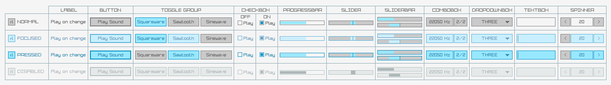
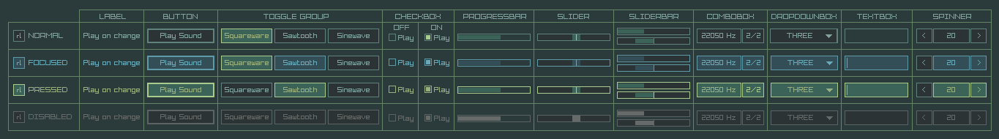

**raygui** is a simple and easy-to-use immediate-mode-gui library.

raygui was initially inspired by [Unity IMGUI](https://docs.unity3d.com/Manual/GUIScriptingGuide.html) (immediate mode GUI API).

raygui was originated as an auxiliar module for [raylib](https://github.com/raysan5/raylib) to create simple GUI interfaces using raylib graphic style (simple colors, plain rectangular shapes, wide borders, raylib default font...).

raygui is intended for **tools development**; it has already been used on tools like [rFXGen](https://github.com/raysan5/rfxgen), [rGuiStyler](https://raylibtech.itch.io/rguistyler) and [rGuiLayout](https://raylibtech.itch.io/rguilayout).

 

## raygui styles

raygui comes with a predefined LIGHT colors style but additional custom styles can be created using [rGuiStyler](https://raylibtech.itch.io/rguistyler) and loaded at runtime using `GuiLoadStyle()` function.

## raygui history

raygui development started on December 2014 by two intenship students (Kevin and Daniel) guided by me, the objective was creating a simple and easy-to-use immediate-mode-gui module for raylib, intended for tools development. On June 2015, library was mostly functional (including basic controls) and we started working in the styling posibilities for the library, focusing on an easy way to style controls properties. Consequently, development of [rGuiStyler](https://raylibtech.itch.io/rguistyler) also started at that point... but resources were quite limited and project didn't move much during the following year, most of the time was invested in [raylib](https://github.com/raysan5/raylib) development.

On June 2016, project was picked up again and raygui 1.0 was released by the end of that month. During August 2016, raygui was used to develop [rFXGen](https://github.com/raysan5/rfxgen) and also an early protoype of [rGuiLayout](https://raylibtech.itch.io/rguilayout), mainly as an usage prove test. After that, raygui project was stopped again for the following months.

On June 2017, a complete redesign of the library started, almost from scratch, all functions were reviewed and mostly rewritten and a brand new styling system was developed. The objective was using raygui professionally in several tools.

On January 2018, two students (Adria and Jordi) started working on raygui and related tools; library evolved considerably in the following months. [rGuiStyler](https://raylibtech.itch.io/rguistyler) was completely redesigned and rewritten from scratch. [rGuiLayout](https://raylibtech.itch.io/rguilayout) turned from a protoype into a professional software and raygui reached version 2.0 with plenty of new controls and features.

From July 2018 onwards, I've been working full time on raygui and its tools. On October 2018 [Sergio](https://github.com/anidealgift) joined the project and focused on [rGuiLayout](https://raylibtech.itch.io/rguilayout) tool redesign and improvement, targeting version 2.0.

## raygui 2.0 provided controls

#### Container/separator controls, useful for controls organization

 - WindowBox
 - GroupBox
 - Line
 - Panel

#### Basic controls

 - Label
 - Button
 - LabelButton
 - ImageButton
 - Toggle
 - ToggleGroup
 - CheckBox
 - ComboBox
 - DropdownBox
 - TextBox
 - TextBoxMulti
 - ValueBox
 - Spinner
 - Slider
 - SliderBar
 - ProgressBar
 - StatusBar
 - ScrollPanel
 - DummyRec

#### Advance controls
 - ListView
 - ColorPicker
 - GuiMessageBox
 - Grid

## Acknowledgements
The following people has invested their time and effort into raygui project. Big thanks to them!

 - [Sergio Martinez](https://github.com/anidealgift) for improving raygui and working on original [rGuiStyler](https://github.com/raysan5/rguistyler) tool and [rGuiLayout](https://raylibtech.itch.io/rguilayout) version 2.0.
 - [Adria Arranz](https://github.com/Adri102) and [Jordi Jorba](https://github.com/KoroBli) for improving raygui, adding new controls and working hard on [rGuiStyler](https://github.com/raysan5/rguistyler) and [rGuiLayout](https://github.com/raysan5/rguilayout) tools redesign and rewrite.
 - Daniel Nicolas and [Kevin Gato](https://github.com/Gatonevermind) for working on initial development.
