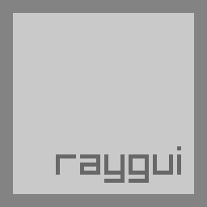
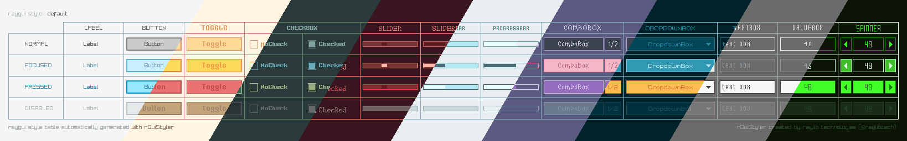
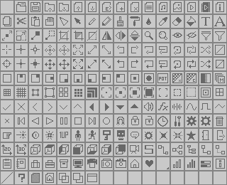
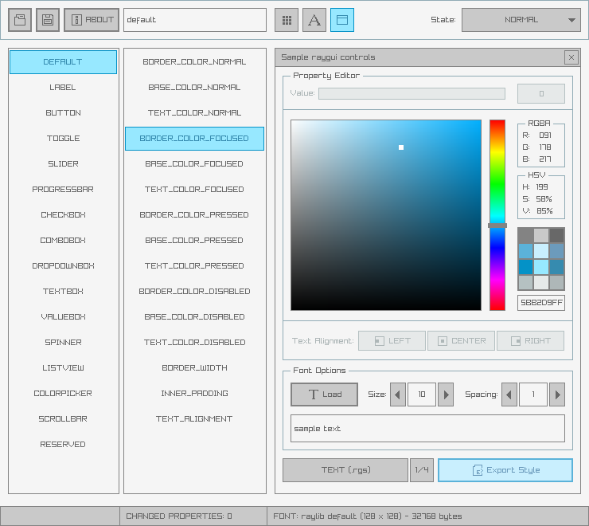
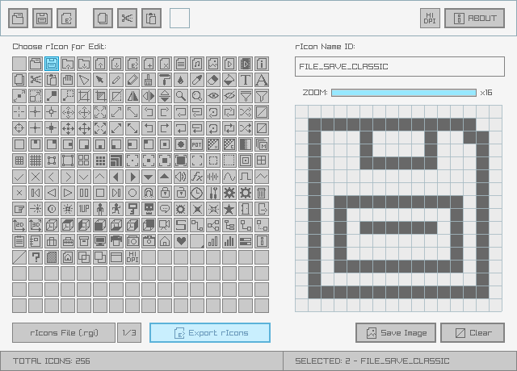
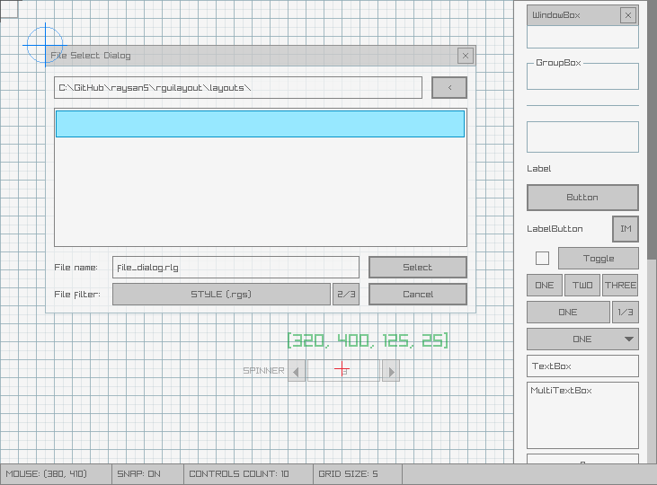

**raygui is a simple and easy-to-use immediate-mode-gui library.**

`raygui` was originally inspired by [Unity IMGUI](https://docs.unity3d.com/Manual/GUIScriptingGuide.html) (immediate mode GUI API).

`raygui` was designed as an auxiliary module for [raylib](https://github.com/raysan5/raylib) to create simple GUI interfaces using raylib graphic style (simple colors, plain rectangular shapes, wide borders...) but it can be adapted to other engines/frameworks.

`raygui` is intended for **tools development**; it has already been used to develop [multiple published tools](https://raylibtech.itch.io).

<br>

**WARNING: Latest `raygui` from master branch is always aligned with latest `raylib` from master branch. Make sure to use the appropiate versions.**

**WARNING: Latest `raygui 4.0` is an API-BREAKING redesign from previous versions (3.x), now all functions are more consistent and coherent, you can read the details about this breaking change in issue [283](https://github.com/raysan5/raygui/issues/283)**

*NOTE: raygui is a single-file header-only library (despite its internal dependency on raylib), so, functions definition AND implementation reside in the same file `raygui.h`, when including `raygui.h` in a module, `RAYGUI_IMPLEMENTATION` must be previously defined to include the implementation part of `raygui.h` BUT only in one compilation unit, other modules could also include `raygui.h` but `RAYGUI_IMPLEMENTATION` must not be defined again.*

## features

 - **Immediate-mode gui, no retained data**
 - **+25** controls provided (basic and advanced)
 - Powerful **styling system** for colors, font and metrics
 - Standalone usage mode supported (for other graphic libs)
 - **Icons support**, embedding a complete 1-bit icons pack
 - Multiple **tools** provided for raygui development

## code sample
```c
#include "raylib.h"

#define RAYGUI_IMPLEMENTATION
#include "raygui.h"

int main()
{
    InitWindow(400, 200, "raygui - controls test suite");
    SetTargetFPS(60);

    bool showMessageBox = false;

    while (!WindowShouldClose())
    {
        // Draw
        //----------------------------------------------------------------------------------
        BeginDrawing();
            ClearBackground(GetColor(GuiGetStyle(DEFAULT, BACKGROUND_COLOR)));

            if (GuiButton((Rectangle){ 24, 24, 120, 30 }, "#191#Show Message")) showMessageBox = true;

            if (showMessageBox)
            {
                int result = GuiMessageBox((Rectangle){ 85, 70, 250, 100 },
                    "#191#Message Box", "Hi! This is a message!", "Nice;Cool");

                if (result >= 0) showMessageBox = false;
            }

        EndDrawing();
    }

    CloseWindow();
    return 0;
}
```


## raygui controls

### basic controls
```
Label       |  Button      |  LabelButton |  Toggle      |  ToggleGroup  |  ToggleSlider
CheckBox    |  ComboBox    |  DropdownBox |  TextBox     |  ValueBox     |  Spinner
Slider      |  SliderBar   |  ProgressBar |  StatusBar   |  DummyRec     |  Grid
```
### container/separator controls
```
WindowBox   |  GroupBox    |  Line        |  Panel       |  ScrollPanel  | TabBar
```
### advanced controls
```
ListView    |  ColorPicker |  MessageBox  |  TextInputBox
```


## raygui styles

`raygui` comes with a [default](styles/default) style automatically loaded at runtime:


Some additional styles are also provided for convenience, just check [styles directory](styles) for details:



Custom styles can also be created very easily using [rGuiStyler](https://raylibtech.itch.io/rguistyler) tool.

Styles can be loaded at runtime using raygui `GuiLoadStyle()` function. Simple and easy-to-use.

## raygui icons

`raygui` supports custom icons, by default, a predefined set of icons is provided inside `raygui` as an array of binary data; it contains **256 possible icons** defined as **16x16 pixels** each; each pixel is codified using **1-bit**. The total size of the array is `2048 bytes`.



To use any of those icons just prefix the *#iconId#* number to **any text** written within `raygui` controls:
```c
if (GuiButton(rec, "#05#Open Image")) { /* ACTION */ }
```
It's also possible to use the provided `GuiIconText()` function to prefix it automatically, using a clearer identifier (defined in `raygui.h`).
```c
if (GuiButton(rec, GuiIconText(RICON_FILE_OPEN, "Open Image"))) { /* ACTION */ }
```
Provided set of icons can be reviewed and customized using [rGuiIcons](https://raylibtech.itch.io/rguiicons) tool.

## raygui support tools

 - [**rGuiStyler**](https://raylibtech.itch.io/rguistyler) - A simple and easy-to-use raygui styles editor.

   

 - [**rGuiIcons**](https://raylibtech.itch.io/rguiicons) - A simple and easy-to-use raygui icons editor.

   

 - [**rGuiLayout**](https://raylibtech.itch.io/rguilayout) - A simple and easy-to-use raygui layouts editor.

   

## building

`raygui` is intended to be used as a portable single-file header-only library, to be directly integrated into any C/C++ codebase but some users could require a shared/dynamic version of the library, for example, to create bindings:

 - **Windows (MinGW, GCC)**
```
copy src/raygui.h src/raygui.c
gcc -o src/raygui.dll src/raygui.c -shared -DRAYGUI_IMPLEMENTATION -DBUILD_LIBTYPE_SHARED -static-libgcc -lopengl32 -lgdi32 -lwinmm -Wl,--out-implib,src/librayguidll.a
```

 - **Windows (MSVC)**
```
copy src\raygui.h src\raygui.c
cl /O2 /I../raylib/src/ /D_USRDLL /D_WINDLL /DRAYGUI_IMPLEMENTATION /DBUILD_LIBTYPE_SHARED src/raygui.c /LD /Feraygui.dll /link /LIBPATH ../raylib/build/raylib/Release/raylib.lib /subsystem:windows /machine:x64
```

 - **Linux (GCC)**
```
mv src/raygui.h src/raygui.c
gcc -o raygui.so src/raygui.c -shared -fpic -DRAYGUI_IMPLEMENTATION -lraylib -lGL -lm -lpthread -ldl -lrt -lX11
mv src/raygui.c src/raygui.h
```

- **Mac (clang, homebrew installed raylib)**
```
cp src/raygui.h src/raygui.c
brew install raylib
gcc -o raygui.dynlib src/raygui.c -shared -fpic -DRAYGUI_IMPLEMENTATION -framework OpenGL -lm -lpthread -ldl $(pkg-config --libs --cflags raylib)
```


## license

raygui is licensed under an unmodified zlib/libpng license, which is an OSI-certified, BSD-like license that allows static linking with closed source software. Check [LICENSE](LICENSE) for further details.
