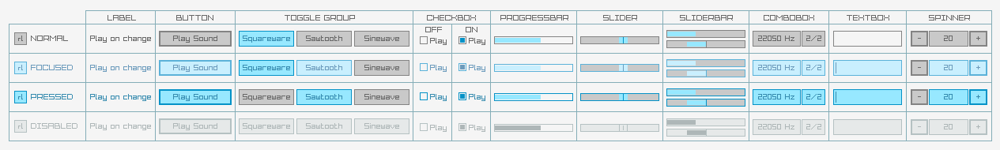
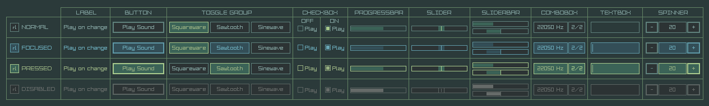

**raygui** is a simple and easy-to-use immediate-mode-gui single-file header-only library.

raygui was inspired by [Unity IMGUI](https://docs.unity3d.com/Manual/GUIScriptingGuide.html) (immediate mode GUI API).

raygui was originated as an auxiliar module for [raylib](https://github.com/raysan5/raylib) to create simple GUI interfaces using raylib graphic style (simple colors, plain rectangular shapes, wide borders, raylib default font...).

raygui is intended for **tools development**; it has already been used on tools like [rFXGen](https://github.com/raysan5/rFXGen), [rGuiStyler](https://github.com/raysan5/raygui/tree/master/tools) and [rGuiLayout](https://github.com/raysan5/raygui/tree/master/tools).

 
 

**NOTE: raygui is under development right now, some controls and styles could be modified in the following weeks.** 

##  styles
Default light style

Default dark style

## history
raygui development started on December 2014 by two intenship students (Kevin Gato and Daniel Nicolas) guided by me, the objective was creating a simple and easy-to-use raylib immediate-mode-gui module, intended for tools development. On June 2015, library was mostly functional (including all planned controls) and work started into the styling options for the library, focusing on an easy way to style some controls properties. Consequently, development of [rGuiStyler](https://github.com/raysan5/raygui/tree/master/tools/rGuiStyler) also started at that point but resources invested on the tool were quite limited and project didn't move much during the following year, most of the time was invested in [raylib](https://github.com/raysan5/raylib) development.

On June 2016, project was picked up again and raygui 1.0 was released at the end of that month. During August 2016, raygui was used to develop [rFXGen](https://github.com/raysan5/rFXGen) and [rGuiLayout](https://github.com/raysan5/raygui/tree/master/tools/rGuiLayout) tools, mainly as an usage prove test. After that, raygui project remained stopped for the following months. 

On June 2017, started a complete redesign of the library, almost from scratch, all functions were reviewed and mostly rewritten and a brand new styling system was developed. The objective of that was using raygui professionally in several tools planed for raylib. Consequently, [rGuiStyler](https://github.com/raysan5/raygui/tree/master/tools/rGuiStyler) was also completely redesigned and rewritten from scratch.

## notes on raygui 1.0
Officially, raygui 1.0 was published on June 2016, about one year and a half after its developmentment started.

## notes on raygui 2.0
Current development version, the one avaliable here, supposed a complete redesign of the library with an improved styling system.

## controls
raygui provides the following controls:
 - Label
 - Button
 - LabelButton
 - ImageButton
 - ImageButtonEx
 - ToggleButton
 - ToggleGroup
 - CheckBox
 - ComboBox
 - GroupBox
 - TextBox
 - Slider
 - SliderBar
 - ProgressBar
 - Spinner
 - ListView
 - ColorPicker

## acknowledgements
The following people has invested their time and effort into raygui project. Big thanks to them!

 - Adria Arranz and Jordi Jorba for improving raygui, adding new controls and working on [rGuiStyler](https://github.com/raysan5/raygui/tree/master/tools/rGuiStyler) redesign and rewrite.
 - [Sergio Martinez](https://github.com/anidealgift) for improving raygui and working on [rGuiStyler](https://github.com/raysan5/raygui/tree/master/tools/rGuiStyler) tool.
 - [Kevin Gato](https://github.com/Gatonevermind) for working on initial development.
 - Daniel Nicolas  for working on initial development.
