# raygui styles

`raygui` comes with **several custom UI styles** carefully designed for the best visual experience. Those styles have been created using [rGuiStyler](https://raylibtech.itch.io/rguistyler) tool and they complement internal [default style](default), always available by `raygui`.

## styles usage 

To use those styles with your `raygui` development, you need to call `GuiLoadStyle()` function at initialization, passing the `.rgs` file to load. Note that `.rgs` is by default a binary file containing the style required font data (glyphs data + glyph atlas image data).

Styles can also be embedded in the code if desired, `.h` files are provided with every style containing all the required style data, including the font data. To embed those fonts just add the `.h` to your project and call the required function as specified in the header info.

Here it is a quick overview of those styles, you can navigate to each directory for additional information.

#### 1. style: [default](default)
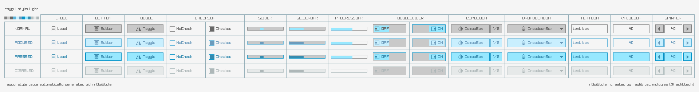

#### 2. style: [dark](dark)
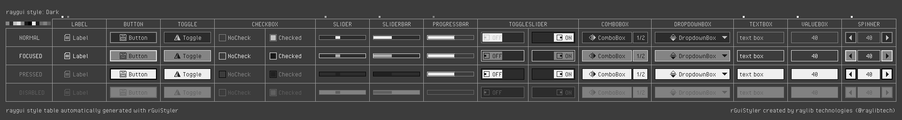

#### 3. style: [bluish](bluish)
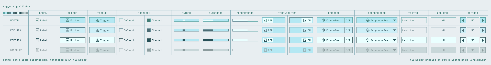

#### 4. style: [candy](candy)
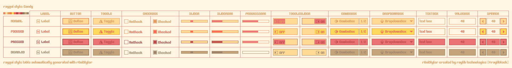

#### 5. style: [cherry](cherry)
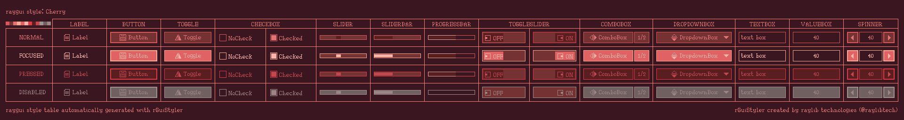

#### 6. style: [cyber](cyber)
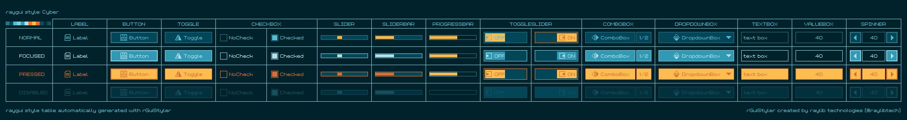

#### 7. style: [jungle](jungle)
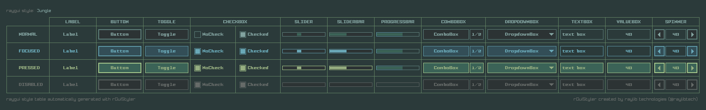

#### 8. style: [lavanda](lavanda)
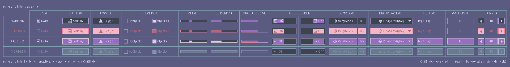

#### 9. style: [terminal](terminal)
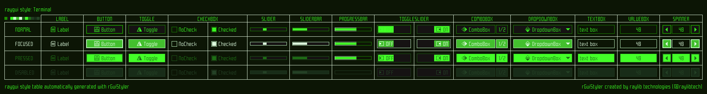

#### 10. style: [sunny](sunny)
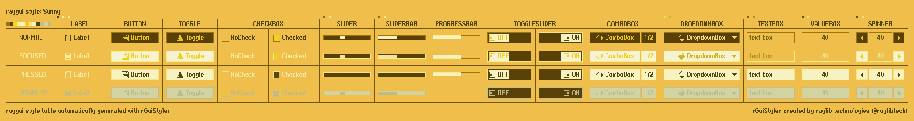

#### 11. style: [ashes](ashes)
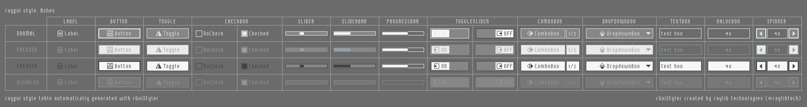

#### 12. enefete: [enefete](enefete)
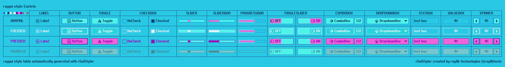

#### 13. amber: [amber](amber)
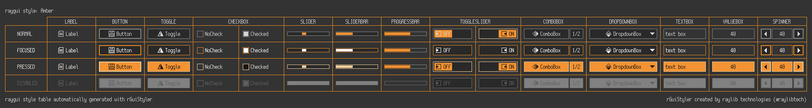

*NOTE: Those styles require raylib 5.5 and raygui 4.5*
