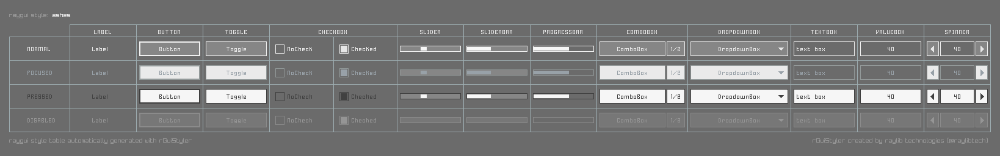
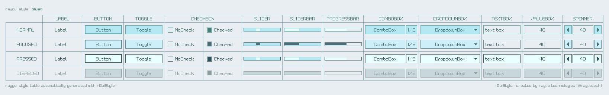
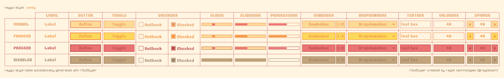
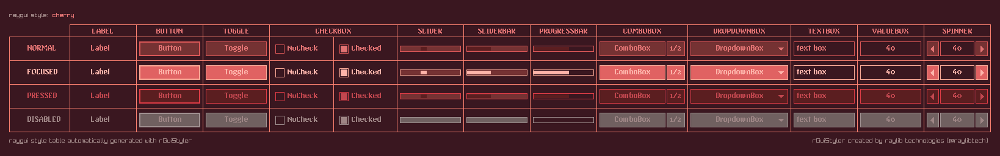
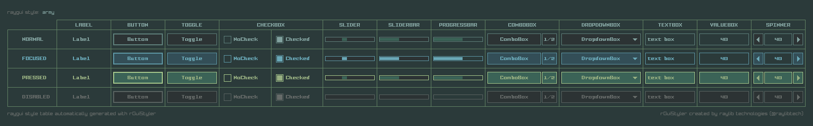

## raygui styles

`raygui` comes with **8 custom styles** carefully designed for the best visual experience. Those styles have been created using [rGuiStyler](https://raylibtech.itch.io/rguistyler) tool and they complement internal [default style](default), always available by `raygui`.

To use those styles with your `raygui` development, just need to call `GuiLoadStyle()` function at initialization, passing the `.rgs` file to load. Note that most of those styles depend on custom fonts that must be available together with the `.rgs` file.

Here it is a quick overview of those styles, you can navigate to each directory for additional information.

#### style: [default](default)

#### style: [ashes](ashes)

#### style: [bluish](bluish)

#### style: [candy](candy)

#### style: [cherry](cherry)

#### style: [cyber](cyber)

#### style: [jungle](jungle)

#### style: [lavanda](lavanda)

#### style: [terminal](terminal)

*NOTE: Those styles require latest raylib 2.6-dev and latest raygui 2.6-dev.*
