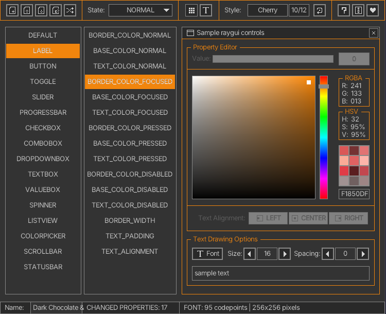

## style: amber

Amber accenture and charcoal tones with a light font for nice visuals.


## style: provided files

Several options are provided to add the style to a `raygui` application, choose the one that better fits the project.

| file name | description |
| :-------- | :---------- |
| `style_amber.rgs` | Binary style file (raygui 4.0), font data compressed (recs, glyphs) |
| `style_amber.h` | Embeddable style as code file, self-contained, includes font data |
| `style_amber.png` | Style table image, contains `rGSf` chunk with binary `rgs` file data |

## screenshot



## about font

"Hello World" font by Anthony Gross
```
CATEGORY: Monospace
LANGUAGE SUPPORT: Latin Extended
FORMAT: TTF
LICENSE: Free for personal and commercial use, SIL Open Font License
``` 

This font is licensed under the Open Font License. More info: https://www.dafont.com/es/hello-world.font

_The style font is optimized to look best at 16px, if you require different sizing please open the style in rGuiStyler and edit it._
