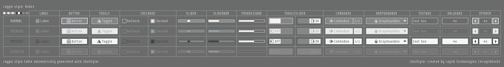

## style: ashes

What once was life now is ashes, just as slight reminiscense covers the ground, a gray sequence of tones that reminds to a distant past.

## style: provided files

Several options are provided to add the style to a `raygui` application, choose the one that better fits the project.

| file name | description |
| :-------- | :---------- |
| `style_ashes.rgs` | Binary style file (raygui 4.0), font data compressed (recs, glyphs) |
| `style_ashes.txt.rgs` | Text style file, no font data, requires external font provided |
| `style_ashes.old.rgs` | Binary style file (raygui 3.x), font data uncompressed (recs, glyphs) |
| `style_ashes.h` | Embeddable style as code file, self-contained, includes font data |
| `style_ashes.png` | Style table image, contains `rGSf` chunk with binary `rgs` file data |

## screenshot

## about font

"V5 Loxica Lixera" font by vFive Digital (Roberto Christen).

100% free font, downloaded from dafont.com: [v5loxica-lixera](https://www.dafont.com/v5loxica-lixera.font)
