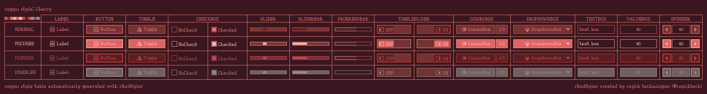

## style: cherry

Sweet with a touch of liquour, covered in chocolate, just give it a try! Not suitable for every palate, only the most demanding. 

## style: provided files

Several options are provided to add the style to a `raygui` application, choose the one that better fits the project.

| file name | description |
| :-------- | :---------- |
| `style_cherry.rgs` | Binary style file (raygui 4.0), font data compressed (recs, glyphs) |
| `style_cherry.txt.rgs` | Text style file, no font data, requires external font provided |
| `style_cherry.old.rgs` | Binary style file (raygui 3.x), font data uncompressed (recs, glyphs) |
| `style_cherry.h` | Embeddable style as code file, self-contained, includes font data |
| `style_cherry.png` | Style table image, contains `rGSf` chunk with binary `rgs` file data |

## screenshot

## about font

"Westington" font by Hazel Abbiati.

100% free font, downloaded from dafont.com: [westington](https://www.dafont.com/westington.font)
