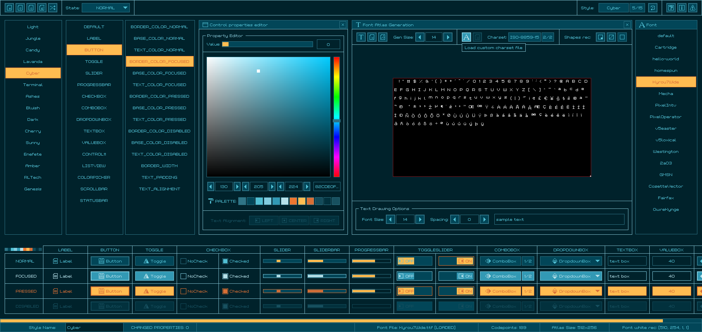

## style: cyber

Future is now! Neons and shadows, city never sleeps! Robots waiting in the corners and expensive vending machines! You got the style!

## style: provided files

Several options are provided to add the style to a `raygui` application, choose the one that better fits the project.

| file name | description |
| :-------- | :---------- |
| `style_cyber.rgs` | Binary style file (raygui 4.0), font data compressed (recs, glyphs) |
| `style_cyber.txt.rgs` | Text style file, no font data, requires external font provided |
| `style_cyber.old.rgs` | Binary style file (raygui 3.x), font data uncompressed (recs, glyphs) |
| `style_cyber.h` | Embeddable style as code file, self-contained, includes font data |
| `style_cyber.png` | Style table image, contains `rGSf` chunk with binary `rgs` file data |

## screenshot

## about font

"Grixel Kyrou 7 Wide" font by [Nikos Giannakopoulos](http://www.grixel.gr/).

100% free font, downloaded from dafont.com: [grixel-kyrou-7-wide](https://www.dafont.com/grixel-kyrou-7-wide.font)
