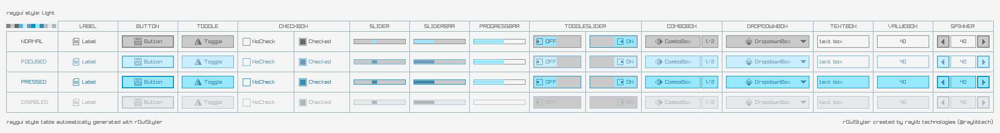

## style: default

raylib style, simple and easy-to-use. Light colors, wide borders, a sophisticated touch.

## style: provided files

Several options are provided to add the style to a `raygui` application, choose the one that better fits the project.

| file name | description |
| :-------- | :---------- |
| `style_default.txt.rgs` | Text style file, no font data, uses raylib default font |
| `style_default.png` | Style table image, contains `rGSf` chunk with binary `rgs` file data |

## screenshot

## about font

raylib font by Ramon Santamaria ([@raysan5](https://twitter.com/raysan5)).
