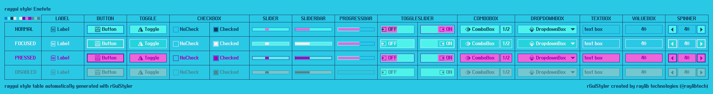

## style: enefete

Inspired by money and pain, a desperate jump into the trendings train, a train to nowhere. Don't stare at it for too long!

## style: provided files

Several options are provided to add the style to a `raygui` application, choose the one that better fits the project.

| file name | description |
| :-------- | :---------- |
| `style_enefete.rgs` | Binary style file (raygui 4.0), font data compressed (recs, glyphs) |
| `style_enefete.txt.rgs` | Text style file, no font data, requires external font provided |
| `style_enefete.old.rgs` | Binary style file (raygui 3.x), font data uncompressed (recs, glyphs) |
| `style_enefete.h` | Embeddable style as code file, self-contained, includes font data |
| `style_enefete.png` | Style table image, contains `rGSf` chunk with binary `rgs` file data |

## screenshot

## about font

"Generic Mobile System" font by de Jayvee Enaguas.

CC0 1.0 Universal, downloaded from dafont.com: [generic-mobile-system](https://www.dafont.com/generic-mobile-system.font)
