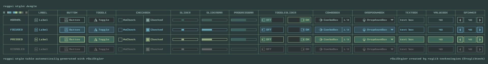

## style: jungle

Sunset in the jungle, trees do not let to see the last rays of sun on the horizon, small creek in the path, mug on the shoes, a touch of danger and the adventure feeling, get into your jeep and drive with this style.  

## style: provided files

Several options are provided to add the style to a `raygui` application, choose the one that better fits the project.

| file name | description |
| :-------- | :---------- |
| `style_jungle.rgs` | Binary style file (raygui 4.0), font data compressed (recs, glyphs) |
| `style_jungle.txt.rgs` | Text style file, no font data, requires external font provided |
| `style_jungle.old.rgs` | Binary style file (raygui 3.x), font data uncompressed (recs, glyphs) |
| `style_jungle.h` | Embeddable style as code file, self-contained, includes font data |
| `style_jungle.png` | Style table image, contains `rGSf` chunk with binary `rgs` file data |

## screenshot

## about font

"Pixel Intv" font by [Pixel Sagas](http://www.pixelsagas.com) (Neale and Shayna Davidson).

100% free font, downloaded from dafont.com: [pixel-intv](https://www.dafont.com/pixel-intv.font)
