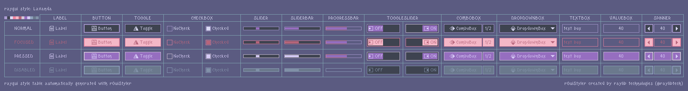
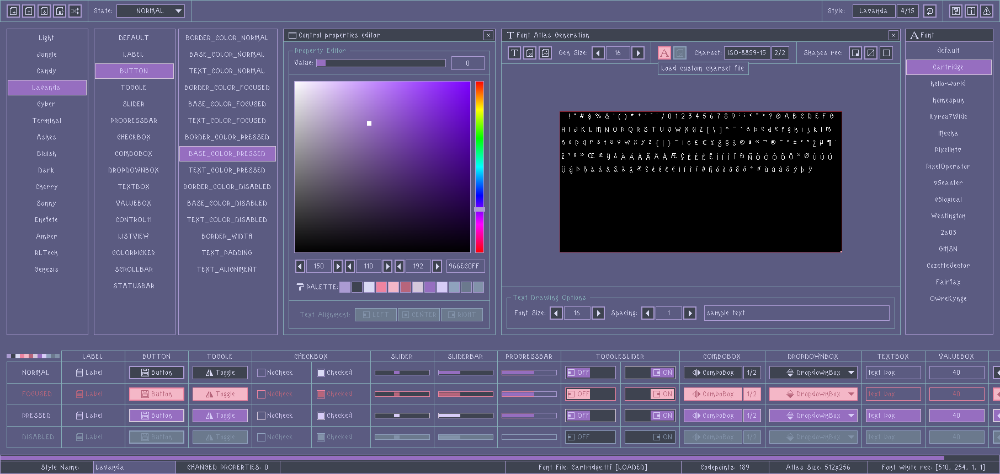

## style: lavanda

Walk thought the fields full of lavanda, feels like a dream, a touch of fantasy, just relax and close your eyes, could you feel it?

## style: provided files

Several options are provided to add the style to a `raygui` application, choose the one that better fits the project.

| file name | description |
| :-------- | :---------- |
| `style_lavanda.rgs` | Binary style file (raygui 4.0), font data compressed (recs, glyphs) |
| `style_lavanda.txt.rgs` | Text style file, no font data, requires external font provided |
| `style_lavanda.old.rgs` | Binary style file (raygui 3.x), font data uncompressed (recs, glyphs) |
| `style_lavanda.h` | Embeddable style as code file, self-contained, includes font data |
| `style_lavanda.png` | Style table image, contains `rGSf` chunk with binary `rgs` file data |

## screenshot

## about font

"Cartridge" font by [jeti](https://fontenddev.com/)

Licensed under [CC BY 4.0](https://creativecommons.org/licenses/by/4.0/), downloaded from dafont.com: [cartridge](https://www.dafont.com/cartridge.font)
