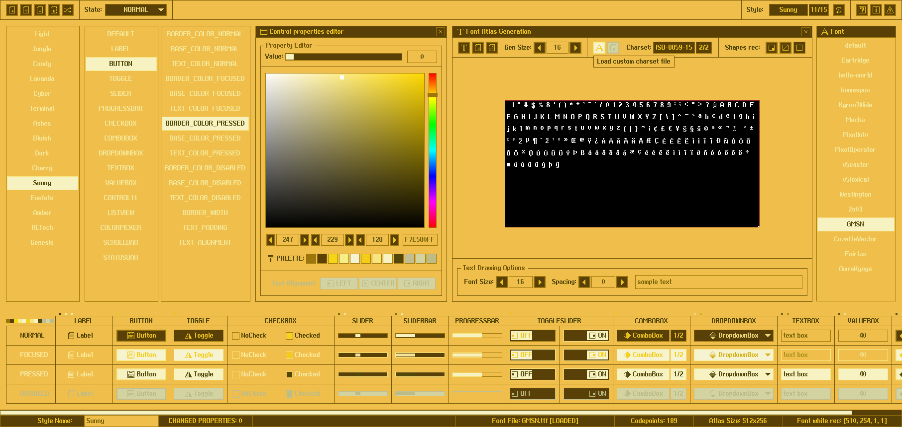

## style: sunny

Sweet, colorful, sunny! Inspired by the [Playdate](https://play.date/) console and its [pulp](https://play.date/pulp/) editor!

## style: provided files

Several options are provided to add the style to a `raygui` application, choose the one that better fits the project.

| file name | description |
| :-------- | :---------- |
| `style_sunny.rgs` | Binary style file (raygui 4.0), font data compressed (recs, glyphs) |
| `style_sunny.txt.rgs` | Text style file, no font data, requires external font provided |
| `style_sunny.old.rgs` | Binary style file (raygui 3.x), font data uncompressed (recs, glyphs) |
| `style_sunny.h` | Embeddable style as code file, self-contained, includes font data |
| `style_sunny.png` | Style table image, contains `rGSf` chunk with binary `rgs` file data |

## screenshot

## about font

"Generic Mobile System" font by Jayvee Enaguas (HarvettFox96).

CC0 free font, downloaded from dafont.com: [generic-mobile-system](https://www.dafont.com/es/generic-mobile-system.font)
