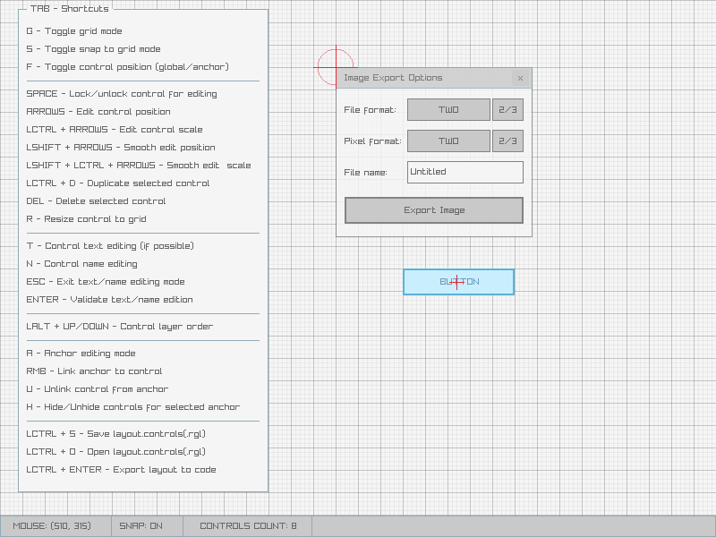
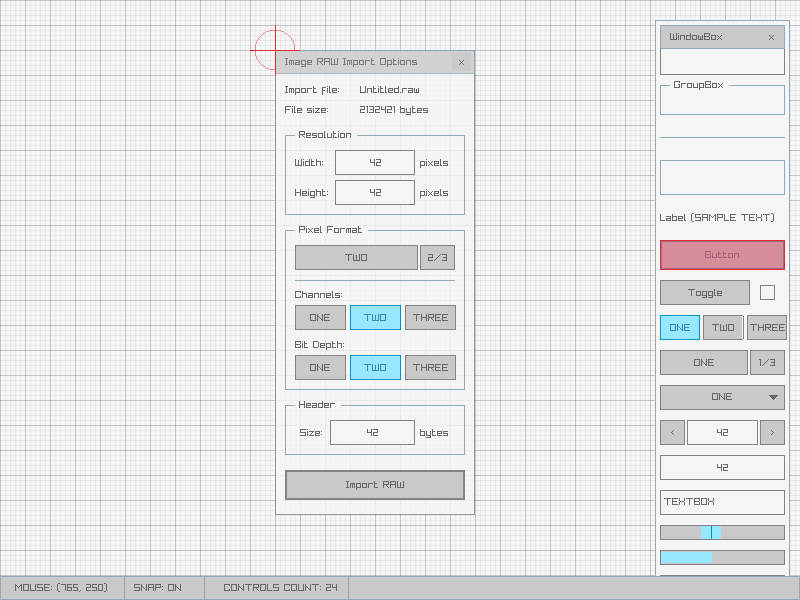
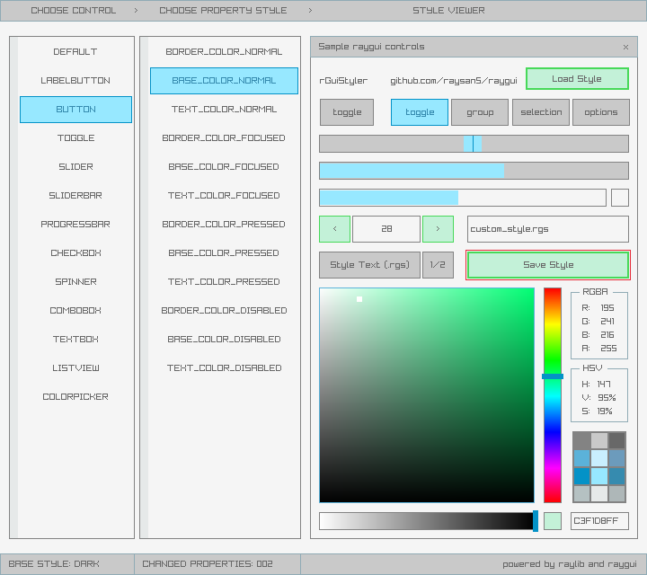

## rGuiLayout and rGuiStyler
Two tools are distributed together with **raygui library** to help on imgui development and styling. 

**rGuiLayout** is a visual layout editor to place controls in a visual way, defined layout could be saved and exported to C code.

**rGuiSyler** is a raygui visual styles editor to create color-sizes variants of default raygui styles

Check those tools folders for further information.

*Copyright (c) 2017-2018 raylib technologies ([@raysan5](https://twitter.com/raysan5))*
