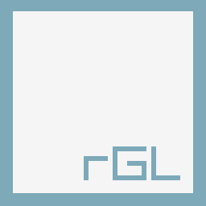

# rGuiLayout
A simple and easy-to-use tool to create raygui-based layouts. Useful for fast tools development. The perfect companion for [rGuiStyler](https://github.com/raysan5/raygui/tree/master/tools/rGuiStyler) tool.

 
 
 
 

## Features

 - **+25 controls available to define your imgui layout**
 - Place controls visually and move/scale them freely
 - Snap to grid mode for maximum precission
 - Save/Load your layout as **.rgl (text or binary mode)**
 - Import **.rgs** files ([rGuiStyler](https://github.com/raysan5/raygui/tree/master/tools/rGuiStyler)) to customize visual style (drag&drop)
 - **Export layout directly as plain C code, ready to edit and compile!**
 - Multiple code generation options to customize exported code
 - Supports image loading to be used as tracemap
 - Autovisible right controls panel for quick selection
 - Anchors mode support to link your controls
 - Controls text edition and name edition (for exported variables)
 - **+10 predefined layout available for reference**
 - **Completely portable (single file)**
 - Free and open source
 
## Usage
The tool is pretty intuitive to use, it mostly works with mouse and several key shortcuts that can be seen just pressing TAB key once program is open. Use mouse wheel to select desired control or RightMouseButton to open controls panel.

You can drag&drop .rgl files for layout loading and also .rgs files (rGuiStyler) for layout style loading. To export created layout as C code, just pres LCTRL+ENTER, you can configure multiple export options to generate the code.

To compile the code, you need raygui library (single-file header-only) and raylib v2.0 library, not yet released on itch.io but already available for early adopters on raylib GitHub, ready to be compiled.
 
## Screenshots

## License

rGuiLayout is free and open source software. rGuiLayout source code is licensed under an unmodified zlib/libpng license. Check [LICENSE](LICENSE) for further details.

Despite being completely free, consider a small donation for the development efforts or contributing to raylib patreon to help the author keep working on free software for games development.

*Copyright (c) 2017-2018 raylib technologies ([@raysan5](https://twitter.com/raysan5))*
